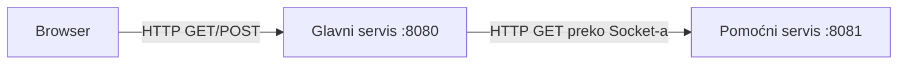

# Quotes Management (domaći 1 — RWA)

Ovaj repozitorijum sadrži jednostavan HTTP server (ručna implementacija preko `ServerSocket`/`Socket`) kome je dodata funkcionalnost za **unos, čuvanje i prikaz citata**, uz **citat dana** koji se dobija od posebnog pomoćnog servisa u JSON formatu.

## Šta radi aplikacija

- **Glavni servis** (`http.Server`, port **8080**):
  - `GET /quotes` — HTML stranica sa:
    - blokom **citat dana** (podaci se dobijaju od pomoćnog servisa),
    - formom za novi citat (tekst + autor),
    - listom svih sačuvanih citata (u memoriji, redosled: najnoviji prvi).
  - `POST /save-quote` — čuva citat iz forme (`application/x-www-form-urlencoded`) i vraća **302 Redirect** na `/quotes`.

- **Pomoćni servis** (`http.AuxiliaryServer`, port **8081**):
  - `GET /qod` — vraća **JSON** sa nasumično izabranim citatom iz unapred definisanog skupa (`quote`, `author`).
  - Posmatra se kao **interni** servis: glavni servis ga poziva prilikom generisanja `/quotes`, dok klijent (browser) komunicira sa glavnim.

## Arhitektura



Komunikacija **između** glavnog i pomoćnog servisa je implementirana **ručno preko `java.net.Socket`** (sastavljen je sirovi HTTP zahtev/odgovor). **Nije** korišćen gotov HTTP klijent. Za **parsiranje i generisanje JSON-a** korišćena je biblioteka **Gson** (`com.google.gson`), u skladu sa ograničenjem zadatka (dozvoljene JSON biblioteke).

## Preduslovi

- **Java** (preporuka: 17+)

## Pokretanje

Pomoćni servis mora biti dostupan dok glavni servis generiše stranicu sa citatom dana (inače se prikaže poruka da citat dana nije dostupan).

### Pokretanje (bez Maven-a)

U dva terminala:

```bash
# terminal 1 (pomoćni)
java -cp "out/production/HTTP_primer:gson-2.8.2.jar" http.AuxiliaryServer
```

```bash
# terminal 2 (glavni)
java -cp "out/production/HTTP_primer:gson-2.8.2.jar" http.Server
```

Zatim u browseru otvori: [http://localhost:8080/quotes](http://localhost:8080/quotes).

Napomena: ako ne koristiš IntelliJ build output (`out/production/...`), možeš kompajlirati ručno (npr. `javac`) uz `gson` na classpath-u.

## Struktura repozitorijuma

| Putanja | Opis |
|--------|------|
| `src/http/Server.java` | Glavni server (sluša na `:8080`, koristi `ServerThread`) |
| `src/http/ServerThread.java` | Parsiranje HTTP zahteva (uklj. `Content-Length`), prosleđivanje na `RequestHandler` |
| `src/app/RequestHandler.java` | Rutiranje (`/quotes`, `/save-quote`, …) |
| `src/app/QuotesController.java` | HTML za `/quotes`, čuvanje citata, poziv pomoćnog servisa preko Socket-a |
| `src/http/AuxiliaryServer.java` | Pomoćni servis (`GET /qod`), JSON citat dana |
| `.gitignore` | Ignoriše build output (`out/`, `target/`) i IDE fajlove |

## Tehničke napomene

- Citati koje korisnik unosi čuvaju se **samo u radnoj memoriji** procesa glavnog servisa; restart briše listu.
- Forma šalje polja `text` i `author`; prazan tekst citata se ne čuva.
- HTML sadržaj koji dolazi od korisnika prikazuje se kroz **escape** znakova (`&`, `<`, `>`, `"`) radi osnovne zaštite od XSS.

## Licenca / predmet

Rad urađen u okviru kursa (RWA) — domaći zadatak „Quotes Management”.
