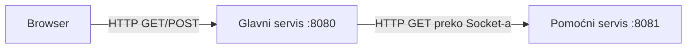

# Quotes Management (domaći 1 — RWA)

Jednostavan sistem za **unos, čuvanje i prikaz citata** u browseru, sa **dva HTTP servisa** na `localhost` i **citat dana** koji dolazi sa pomoćnog servisa u JSON formatu.

## Šta radi aplikacija

- **Glavni servis** (`quotes.MainServer`, port **8080**):
  - `GET /quotes` — HTML stranica sa:
    - blokom **citat dana** (podaci se dobijaju od pomoćnog servisa),
    - formom za novi citat (tekst + autor),
    - listom svih sačuvanih citata (u memoriji, redosled: najnoviji prvi).
  - `POST /save-quote` — čuva citat iz forme (`application/x-www-form-urlencoded`) i vraća **302 Redirect** na `/quotes`.

- **Pomoćni servis** (`quotes.AuxiliaryServer`, port **8081**):
  - `GET /qod` — vraća **JSON** sa nasumično izabranim citatom iz unapred definisanog skupa polja `quote` i `author`.
  - Namenjen je kao **interni** servis: u scenariju zadatka klijent (browser) komunicira samo sa glavnim; glavni ga poziva kada gradi stranicu `/quotes`.

## Arhitektura



Komunikacija **između** glavnog i pomoćnog servisa je implementirana **ručno preko `java.net.Socket`** (sastavljen je sirovi HTTP zahtev/odgovor). **Nije** korišćen gotov HTTP klijent. Za **parsiranje i generisanje JSON-a** korišćena je biblioteka **org.json** (`org.json:json`), u skladu sa ograničenjem zadatka.

## Preduslovi

- **Java 17** (ili novija, kompatibilna sa `release 17` u `pom.xml` i `build.sh`).

## Pokretanje

Pomoćni servis mora biti dostupan dok glavni servis generiše stranicu sa citatom dana (inače se prikaže poruka da citat dana nije dostupan).

### Varijanta A — Maven

```bash
mvn -q package
CP="target/classes:target/dependency/*"
java -cp "$CP" quotes.AuxiliaryServer   # terminal 1
java -cp "$CP" quotes.MainServer        # terminal 2
```

Zatim u browseru otvori: [http://localhost:8080/quotes](http://localhost:8080/quotes).

### Varijanta B — `build.sh` (bez Maven-a)

Skripta preuzima JAR za `org.json` u `lib/` (ako nedostaje), kompajlira izvore u `target/classes`:

```bash
chmod +x build.sh
./build.sh
java -cp "target/classes:lib/json-20240303.jar" quotes.AuxiliaryServer
java -cp "target/classes:lib/json-20240303.jar" quotes.MainServer
```

## Struktura repozitorijuma

| Putanja | Opis |
|--------|------|
| `src/main/java/quotes/MainServer.java` | Glavni HTTP server, rute, HTML, poziv pomoćnog preko Socket-a |
| `src/main/java/quotes/AuxiliaryServer.java` | Pomoćni server, `GET /qod`, JSON |
| `pom.xml` | Maven projekat, zavisnost `org.json`, kopiranje zavisnosti u `target/dependency` pri `package` |
| `build.sh` | Alternativna kompilacija sa `javac` + JAR iz Maven Central-a |
| `.gitignore` | Ignoriše `target/` i `lib/*.jar` |

## Tehničke napomene

- Citati koje korisnik unosi čuvaju se **samo u radnoj memoriji** procesa glavnog servisa; restart briše listu.
- Forma šalje polja `text` i `author`; prazan tekst citata se ne čuva.
- HTML sadržaj koji dolazi od korisnika prikazuje se kroz **escape** znakova (`&`, `<`, `>`, `"`) radi osnovne zaštite od XSS.

## Licenca / predmet

Rad urađen u okviru kursa (RWA) — domaći zadatak „Quotes Management”.
